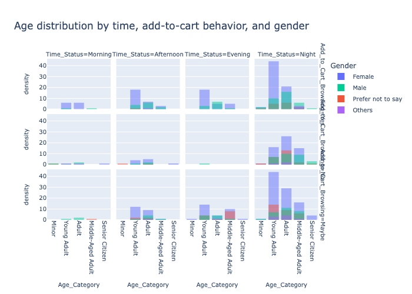

# Capstone Project
This project aims to classify Amazon customers based on their add-to-cart behavior, specifically whether they add products while browsing (Yes), do not add any (No), or are uncertain (Maybe), using their browsing activity and survey responses. To achieve this, we apply machine learning models, including
 - Logistic Regression
 - K-Nearest Neighbor(KNN)
 - Decision Trees
 - Support Vector Machines(SVM)
 - XGBoost
 - GaussianNB
 - Random Forest.

The dataset is designed to provide insights into customer preferences, shopping habits, and decision-making processes. By analyzing it, researchers and analysts can gain a deeper understanding of consumer behavior, identify emerging trends, optimize marketing strategies, and enhance the overall customer experience on Amazon.

## Understanding the Data
This dataset originates from [Kaggle](https://www.kaggle.com/datasets/swathiunnikrishnan/amazon-consumer-behaviour-dataset) and was collected through a survey on the Amazon ecosystem.
 - **Size:** 603 observations with 23 features
 - **Label:**
    - "Yes": customer added item(s)
    - "No": customer browsing only
    - "Maybe": customer is uncertain
 - **Features/Descriptions**
   
| Feature Name                          | Description                                                  |
|---------------------------------------|--------------------------------------------------------------|
| Timestamp                             | Date and time of the response                                |
| age                                   | Respondent's age                                             |
| Gender                                | Respondent's gender                                          |
| Purchase_Frequency                    | Frequency of purchases on Amazon                             |
| Purchase_Categories                   | Common product categories purchased                          |
| Personalized_Recommendation_Frequency | Bought from personalized recommendations?                    |
| Browsing_Frequency                    | How often user browses Amazon                                |
| Product_Search_Method                 | How the user searches for products                           |
| Search_Result_Exploration             | Tendency to explore beyond first page                        |
| Customer_Reviews_Importance           | Importance of customer reviews                               |
| Add_to_Cart_Browsing                  | Adds items to cart while browsing?                           |
| Cart_Completion_Frequency             | Frequency of completing purchases                            |
| Cart_Abandonment_Factors              | Reasons for abandoning cart                                  |
| Saveforlater_Frequency                | Uses “Save for Later” feature?                               |
| Review_Left                           | Left a review on Amazon?                                     |
| Review_Reliability                    | Trust in customer reviews                                    |
| Review_Helpfulness                    | Finds other reviews helpful?                                 |
| Recommendation_Helpfulness            | Finds recommendations helpful?                                       |
|Rating_Accuracy	                       |How would you rate the accuracy of the recommendations you receive    |
|Shopping_Satisfaction                 	|How satisfied are you with your overall shopping experience on Amazon?|
|Service_Appreciation	                  |What aspects of Amazon's services do you appreciate the most?|
|Improvement_Areas                      |	Are there any areas where you think Amazon can improve?|

  
### Detailed Insights
The dataset was examined for missing values, duplicates, and outliers: 
  - Only 2 null values were found in the Product_search_Method column; they were replaced with the mode of that column.
  - The dataset contains a duplicated column, Personalized_Recommendation_Frequency, once as an object type and once as int64.
  - No outliers were detected in the dataset.
    
Based on my analysis of the dataset, several interesting patterns emerged about how customers interact with Amazon. These insights individually focus on age, gender, product preferences, and browsing habits:
- Age Group Activity: Young users aged 0–20 are the most active on the platform. They interact with the website more than other age groups.
- Gender Breakdown: Most customers are female (58.5%), followed by male (23.6%), prefer not to say (14.8%), and others (3.16%).
- Popular Product Categories:
 The top three categories are: Clothing and Fashion, Beauty and Personal Care, and Others.
In comparison, categories like Groceries and Home and Kitchen are less popular.
- What Customers Like:
People appreciate: Product recommendations, Good prices, A wide selection of items
- What Needs Improvement:
Customers want better: Customer service, Product quality and accuracy, and Less packaging waste.
- Browsing Patterns: Female users tend to browse more during the evening and night.

  
  
  

  
  
  

### Combined Insight: Age, Gender, Time, and Purchase Behavior
When we look at age, gender, time, and add-to-cart behavior, Female adults and young adults are the main group who browse without buying, especially at night. The same group also tends to make purchases at night more than others.

## Understanding the Task
The goal of this machine learning project is to identify the key factors that influence whether a customer adds an item to their cart on Amazon. By understanding the patterns behind this behavior, we aim to improve product engagement and conversion strategies.

We seek to answer questions such as:
- Do age, gender, and certain times of day affect add-to-cart behavior?
- Do frequent shoppers add to cart more often?
- Which product categories lead to more cart activity?
- Are personalized recommendations linked to add-to-cart actions?
- Does the way customers interact with reviews impact their purchase intent?

## Engineering Features
The following steps were taken to prepare the data for modeling:

- Feature Selection:
   The top 10 features selected using SelectKBest with ANOVA F-test include a mix of encoded categorical and numerical    variables such as Gender, Time_Status, Age_Category, Browsing_Frequency, Personalized_Recommendation_Frequency,    Recommendation_Helpfulness, and Shopping_Satisfaction, among others.
  
- Preprocessing with ColumnTransformer:
  - Numerical features were passed through without modification.
  - Categorical features were transformed using OneHotEncoder to handle non-numeric values appropriately.
- Target Encoding:
The target variable (Add_to_Cart_Browsing) was encoded into numeric labels using pandas.Categorical.
- Data Splitting:
The dataset was split into training and testing sets using train_test_split, with 80% of the data used for training and 20% reserved for testing.

## Baseline Model
For the baseline model, we chose Logistic Regression, a simple yet effective method that can handle multi-class classification. 
After training and testing the model on the dataset, the following results were observed:
| Model Name          | Accuracy   | Precision  | Recall 	   | F1_Score   | 
|---------------------|:-----------|:-----------|:-----------|:-----------|
| Logestic Regression | 0.6362     | 0.7240     | 0.6924    |  0.6995    | 

This shows that the model performs consistently across accuracy, precision, recall, and F1-score, without strongly favoring either class. The similar values across metrics suggest the model is fairly balanced. However, there’s still room to improve, and further tuning, better feature engineering, or different models, such as decision trees, random forests, or XGBoost, could help increase its performance.

## Improving the Model
To improve model performance, the following strategies were applied
  - Class balancing with SMOTE: This technique was used to address imbalance across the three target classes, enabling models to learn from underrepresented groups more effectively.

- Model experimentation: Multiple classification models such as KNN, SVM, Decision Tree, Random Forest, GaussianNB, XGBoost were tested to compare performance and identify the most suitable algorithm for the task.

- Hyperparameter tuning: RandomizedSearchCV was used to optimize key model parameters such as the number of neighbors, depth, and learning rate to improve generalization and reduce overfitting.

These improvements collectively led to more balanced and accurate predictions across all three target classes.

Results before hyperparameter tuning
|Model Name           |Train Accuracy   | Test Accuracy  | Train Time(s) |
|---------------------|:----------------|:---------------|:--------------|
| knn                 | 0.6383          | 0.5785         | 0.0510        |
| SVM                 | 0.6798          | 0.6612         | 0.0448        |
| Decision Tree       | 0.6965          | 0.6364         | 0.0382        |
| GaussianNB          | 0.6466          | 0.6942         | 0.0354        |
| Random Forest       | 0.6965          | 0.6364         | 0.3709        |
| XGBoost             | 0.6965          | 0.6612         | 0.2280        |

Results after hyperparameter tuning
| Model Name          | Train Accuracy   |Test Accuracy  | Train Time(s) |
|---------------------|:-----------------|:--------------|:--------------|
| knn                 | 0.6985           | 0.6364        | 1.55          |
| SVM                 | 0.6611           | 0.7190        | 2.78          |
| Decision Tree       | 0.6736           | 0.6446        | 1.69          |
| GaussianNB          | 0.6071           | 0.6364        | 2.54          |
| Random Forest       | 0.7339           | 0.7190        | 15.95         |
| XGBoost             | 0.7900           | 0.6612        | 7.10          |

Model Performance Analysis:
- Before hyperparameter tuning, the strongest performer was GaussianNB, which achieved the highest test accuracy (0.6942) despite a relatively modest training accuracy (0.6466). Other models such as SVM and XGBoost performed reasonably, while Decision Tree and Random Forest both settled at 0.6364 test accuracy. KNN remained the weakest with 0.5785 test accuracy.

- After hyperparameter tuning, performance improved significantly, and the training results reveal an important insight:

   - Random Forest achieved 0.7339 train accuracy and 0.7190 test accuracy, showing only a small gap between training and testing performance. This indicates a good fit with relatively low overfitting.

    - SVM, by contrast, had 0.6611 train accuracy and 0.7190 test accuracy. While it generalized well, the notably lower training score suggests that it underfitted the data compared to Random Forest.

   - XGBoost reached the highest training accuracy (0.7900), but its test accuracy plateaued at 0.6612, a clear sign of overfitting given the limited dataset size.

   - Other models showed modest improvements but did not match the performance of Random Forest and SVM. Notably, GaussianNB declined in both train and test accuracy after tuning.

Conclusion:
Considering both training and testing accuracy, Random Forest is the most reliable model for this dataset. It offers strong test performance while maintaining balanced training accuracy, avoiding the underfitting risk seen in SVM and the overfitting problem of XGBoost.

## Next Steps and Recommendations

Despite its usefulness, the dataset has several important drawbacks:
- The dataset covers only a 13-day period, which limits its ability to capture seasonal patterns such as holidays, sales events, or weekday vs weekend variations. This short window introduces temporal bias and reduces the representativeness of long-term consumer behavior.
- The sample size is relatively small (602 records), which reduces statistical power and makes it harder to build robust, generalizable models. Small datasets are also more vulnerable to noise and overfitting.
- Being survey-based, the data may contain response bias (such as socially desirable answers) and imprecise categories such as "Sometimes" or "Few times a month", which weaken the accuracy of the analysis.

## Using Text Classification to Detect Suicide Ideation 

**Lois Wong**

### Executive summary

**Project overview and goals:** The goal of this project is to identify more effective ways for detecting people who are at risk for suicide by identifying and evaluating the best model for detecting suicide ideation in social media posts. We will be training and tuning four binary text classification models to accurately classify social media posts as suicidal or non-suicidal. Models will be able to predict, from future/unseen posts, whether their writer is at risk for suicide. We will then evaluate and compare the four models' performances to identify the best one, then further scrutinize it to find the most effective features (words) that enhance performance in this classification task. We will draw insights from this model by conducting a global analysis, using the ELI5 and LIME libraries identify the most important words/features used for making accurate predictions. We will also be locally analyzing this model and evaluating its class prediction process for individual posts. Lastly, we will draw insights from our analyses and recommmend areas to research and courses to undertake for future work in detecting suicide ideation.  

**Findings:** The best model for detecting suicide ideation is the Support Vector Classifier model, with an accuracy score of 0.924, a recall of 0.916, and an F-1 of 0.924. Its performance is followed by the Logistic Regression model, Naive Bayes model, and the Decision Tree model. This decision is based off comparing the finetuned models' accuracy, recall, and F1 scores (results summary below). The SVC model has the best accuracy (0.924), the Naive Bayes model has the best recall (0.955), and the SVC model has the best F1 score (0.924). As for the errors of each model, Logistic Regression has nearly twice as many FN (false negatives) as FP (false positives); Naive Bayes has nearly four times as many FP as FN; Decision Tree has similar FP and FN counts with slightly more FN, and SVC has slightly more FN than FP. 

**Results and conclusion:** Our evaluation of the best model returned a list of words associated with their feature importance, or how helpful/unhelpful they were in the classification task. A global model analysis revealing the most effective (stemmed) words to detect [+ suicide] across the entire data shows the top five features to be ["suicid", "kill", "end", "pill", "life"] (results below). 

A local model analysis consisting of two example predictions (one suicide, one non-suicide) returns the most prominent features of those individual posts in the class decision. The KL-divergence for this non-suicidal class prediction is ~0.012, indicating close similarity in predictions between the black box model and the model built with LIME used for interpretation.

Image (below): Feature weights of a non-suicidal post prediction 

Image (below): Feature weight of a suicidal post prediction. A dark green highlight indicates substantial importance in the prediction while dark red indicates negative importance, or the word reduces the prediction value/increases the loss. The KL-divergence for this prediction is ~0.010, indicating close similarity in predictions between the black box model and the model built with LIME used for interpretation. 

This study shows that a word's presence in a document/social media post plays a significant role in the task of identifying individuals with suicide ideation -- some words more than others. Below is a word cloud, which showcases the most representative (common) words of each class. Further work can be done in crosschecking this ordering of words vs their weights assigned by not just the SVC model but also the Logistic Regression, Decision Tree, and Naive Bayes models. 

**Future research and development:** Comparing the two feature values shows an interesting dichotomy in the feature importance assigned "feel". It has a high positive score in classifying our first post as non-suicidal and a negative importance in classifying our second post as suicidal. This gives way to a theory that the absense of certain words is a significant feature in gauging a post's non-membership of a class -- and in a binary classification problem, its membership of the second class. Because it is impossible for a person/post to be both or neither suicidal nor non-suicidal, saying that a post is not [suicidal] is synonymous with saying it is [not suicidal].

**Next steps and recommendations:** We can explore this possibility by **using the pandas query function to compile two lists of words: Those that appear only in suicidal posts and those that only appear in non-suicidal posts.** One might begin by **building two vocabularies**, the first consisting of every unique word from the all the posts in the suicidal class, and the second consisting of every unique word from the non-suicidal class. It may be illuminating to **go through these two vocabularies and make a list of [words that appear in class 1 and not in class 0] and another list of [words that appear in class 0 and not in class 1]**. Additionally, one could **cross check the model permutation importance scores of words in these two lists to see if they have high absolute permutation importance values.**

Additionally, further work can be done in improving the performance of the best classification model. **The best model can be extended, further fine-tuned, or even replaced by experimenting with or incorporating other algorithms and techniques, such as ensemble methods or recurrent neural networks**. Future exploration can also be done in **crosschecking the importance of words, as indicated by the word cloud, and the words' weights, assigned by not just the SVC model but also the Logistic Regression, Decision Tree, and Naive Bayes models.**

### Rationale

The problem this project tries to solve is the growing rate of suicide. According to the CDC, suicide rates increased 30% between 2000 and 2018, and in 2020, suicide was among the top 9 leading causes of death for individuals aged 10-64, taking the lives of 45,979 people that year.  The number of individuals who think about or attempt suicide is even greater, with an estimated 12.2 million American adults seriously considering suicide in 2020, 3.2 million planned attempts, and 1.2 million actual attempts. (Centers for Disease Control and Prevention [CDC], 2022)

Suicide can be prevented, and the first step to prevention is identifying those in need of support/treatment.   

### Research Question

The question this project aims to answer is what is the best classification model for detecting individuals at risk for suicide, as well as what the best features (words) for this task are.

### Data Sources

**Dataset:**The dataset used in this project is sourced from Kaggle and can be accessed at https://www.kaggle.com/datasets/nikhileswarkomati/suicide-watch. 

The data are a collection of posts collected from the 'SuicideWatch' and 'teenagers' subreddits from the Reddit platform using PushshiftAPI. Posts were created between 16 December 2008 - 2 January 2021. Social media posts collected from the 'SuicideWatch' subreddit are labelled 'suicide', while posts collected from 'teenagers' are labelled 'non-suicide'. The original dataset has 232,074 rows and three columns: (1) "Unnamed : 0" is a unique ID for each row (2) "text" is the text content of the social media post (3) "class" indicates whether the poster is suicidal or not; unique values: ['suicide', 'non-suicide']

20,000 random samples from the data is used for model training to facilitate computation. 

**Exploratory data analysis:** There are no null values in this data, and the length of the majority of posts lie under 500 characters, with very few exceeding 2000 characters. Mean character count is 680.136, min character count is 7, and max character count is 40106. This is illustrated below. 

**Cleaning and preparation:** The unique ID column was dropped because it adds no meaningful information to the analysis. The "class" column was renamed "suicide", and its values numerically represented by designating the "suicide" class as 1 and the "non-suicide" class 0. 

The data is randomly split into train and test sets to facilitate holdout cross validation, with a test size of 0.25. 

**Preprocessing:** A preprocessing function is written to first tokenize posts using TweetTokenizer and ignore casing. Stopwords and punctuation are removed, and the remaining words are stemmed with PorterStemmer. Lemmatization is not used because previous testing of that method on this data revealed little to no improvement in model performance (accuracy) and took significantly longer to run. 

**Final Dataset:** The final dataset consists of two columns: "text" indicating the textual contents of the social media post, and "suicide" indicating the class -- 1 for suicidal and 0 for non-suicidal. 

The data are balanced, with comparable counts of suicide and non-suicide posts. This makes accuracy score a suitable metric for evaluating models trained on this data. Class distribution of posts can be seen below. 

The first five rows of the dataframe can be seen below. 

### Methodology

Holdout cross validation is implemented. Models were trained on the training set and validated with the test set. Additionally, RandomizedSearchCV was used to evaluate models using accuracy score, and fine tuned each model's hyperparameters to maximize this metric.  Accuracy is suitable because we have a balanced dataset and measures the proportion of correctly predicted observations out of total observations. It is calculated as (True Positive count + True Negative count) / (Total count), or

$$
\frac{TP + TN}{TP + TN + FP + FN}
$$

Four models were trained, fine-tuned, and will be later compared to find the best model for this task.

**Naive Bayes Model:** A pipeline object is created to standardize the data using TF-IDF and instantiate a Naïve Bayes model. RandomizedSearchCV is used to find the optimal alpha value (options: [1, 0.1, 0.01, 0.001, 0]), which turned out to be 0.1.

**Logistic Regression Model:** A pipeline object is created to standardize the data using TF-IDF and instantiate a Logistic Regression model. RandomizedSearchCV is used to find (1) the optimal penlaty, with the options being ['l1', 'l2', 'none'] and (2) whether an intercept term should be included (options: [True, False]). The best model has l2 penalty and an intercept term.

**Decision Tree Model:** A pipeline object is created to standardize the data using TF-IDF and instantiate a Decision Tree model. RandomizedSearchCV is used to find (1) the optimal tree criterion, with the options being ['gini', 'entropy'], (2) max depth (options: [None, 1, 2, 3, 4]), and (3) the minimum sample count required to split a node (options: [1, 2, 3, 4]). The best model has a minimum sample split of 3, no max depth, and uses the gini criterion.

**Support Vector Classifier Model:** A pipeline object is created to standardize the data using TF-IDF and instantiate a Support Vector Classifier model using a linear kernel. RandomizedSearchCV is used to (1) The optimal C value (options: [0.1, 1, 10, 100, 1000]) and (2) Probability (options: [True, False]). The best model has a probability = True and a C value of 1.

### Model evaluation and results 

Model performance will be visualized using confusion matrices, which indicate the counts of each error type a model made in the classification task. In these plots, 0 = not suicidal and 1 = suicidal.

**Support vector classifier model:** The SVC model is the best model for detecting suicide ideation, with an accuracy score of 0.924, a recall of 0.916, and an F-1 of 0.924. This decision is based off comparing the fine-tuned models' accuracy, recall, and F1 scores. Out of all the models, the SVC has the best accuracy and F1 scores, and the second best recall score. It also took the longest to train, at 2339 seconds. It predicts slightly more false negatives than false positives and its confusion matrix can be seen below. 

**Logistic regression model:**  The Logistic Regression model has an accuracy of 0.917, recall of 0.899, and F-1 of 0.916. It predicts nearly twice as many FN (false negatives) as FP (false positives), indicating that it is much more likely to classify a suicidal person as non-suicidal than vice versa. Its confusion matrix can be seen below. 

**Naive Bayes model:** The Naive Bayes model has an accuracy of 0.890, the best overall recall of 0.955, and an F-1 of 0.897. It predicts nearly four times as many false positives as false negatives, indicating it is much more likely to classify a non-suicidal person as suicidal than the other way around. Its confusion matrix can be seen below. 

 
**Decision tree model:** The Decision Tree model has an accuracy of 0.822, a recall of 0.814, and an F-1 of 0.822. It takes the least amount of time to train at 16 seconds, and has similar false positive and false negative counts. Its confusion matrix can be seen below. 

A detailed interpretation and evaluation of the best model can be found in the results and conclusion section of the executive summary above. 

### Outline of project

[Link to download data](http://localhost:8888/files/Downloads/ML%20ipynb/Capstone/SuicideDetection.csv?_xsrf=2%7C01e7821a%7C54dac168862e9a75a5e46c1d11d7822e%7C1658864864) 

[Link to notebook](http://localhost:8888/lab/tree/capstone/SuicideIdeationDetection.ipynb) 

[Link to download notebook](http://localhost:8888/files/capstone/SuicideIdeationDetection.ipynb?_xsrf=2%7Cd31ff0b1%7C93c2c365c2bec949e09c3632966e8050%7C1662161901)

[Link to evaluation](http://localhost:8888/lab/tree/capstone/CapstoneEvaluation.ipynb)

[Link to download evaluation](http://localhost:8888/files/capstone/CapstoneEvaluation.ipynb?_xsrf=2%7Cd31ff0b1%7C93c2c365c2bec949e09c3632966e8050%7C1662161901)

### Contact and Further Information

Lois Wong

Email: lois@berkeley.edu 

[LinkedIn](linkedin.com/in/lois-wong)

