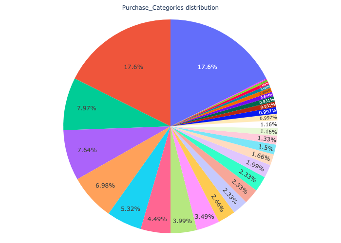
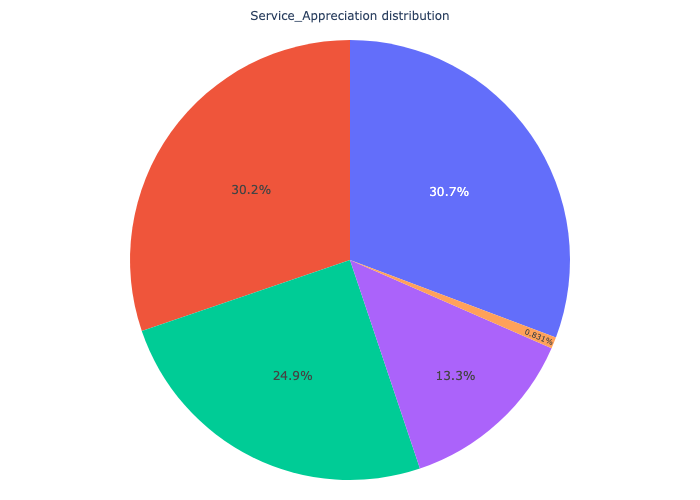
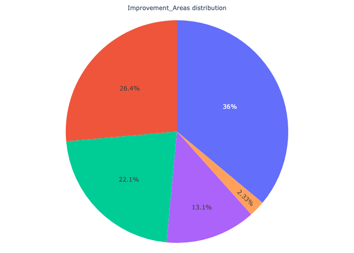

# Capstone Project
This project aims to classify Amazon customers based on their add-to-cart behavior, specifically whether they add products while browsing (Yes), do not add any (No), or are uncertain (Maybe), using their browsing activity and survey responses. To achieve this, we apply machine learning models, including
 - Logistic Regression
 - K-Nearest Neighbor(KNN)
 - Decision Trees
 - Support Vector Machines(SVM)
 - XGBoost
 - GaussianNB
 - Random Forest.

The dataset is designed to provide insights into customer preferences, shopping habits, and decision-making processes. By analyzing it, researchers and analysts can gain a deeper understanding of consumer behavior, identify emerging trends, optimize marketing strategies, and enhance the overall customer experience on Amazon.

## Understanding the Data
This dataset originates from [Kaggle](https://www.kaggle.com/datasets/swathiunnikrishnan/amazon-consumer-behaviour-dataset) and was collected through a survey on the Amazon ecosystem.
 - **Size:** 603 observations with 23 features
 - **Label:**
    - "Yes": customer added item(s)
    - "No": customer browsing only
    - "Maybe": customer is uncertain
 - **Features/Descriptions**
   
| Feature Name                          | Description                                                  |
|---------------------------------------|--------------------------------------------------------------|
| Timestamp                             | Date and time of the response                                |
| age                                   | Respondent's age                                             |
| Gender                                | Respondent's gender                                          |
| Purchase_Frequency                    | Frequency of purchases on Amazon                             |
| Purchase_Categories                   | Common product categories purchased                          |
| Personalized_Recommendation_Frequency | Bought from personalized recommendations?                    |
| Browsing_Frequency                    | How often user browses Amazon                                |
| Product_Search_Method                 | How the user searches for products                           |
| Search_Result_Exploration             | Tendency to explore beyond first page                        |
| Customer_Reviews_Importance           | Importance of customer reviews                               |
| Add_to_Cart_Browsing                  | Adds items to cart while browsing?                           |
| Cart_Completion_Frequency             | Frequency of completing purchases                            |
| Cart_Abandonment_Factors              | Reasons for abandoning cart                                  |
| Saveforlater_Frequency                | Uses “Save for Later” feature?                               |
| Review_Left                           | Left a review on Amazon?                                     |
| Review_Reliability                    | Trust in customer reviews                                    |
| Review_Helpfulness                    | Finds other reviews helpful?                                 |
| Recommendation_Helpfulness            | Finds recommendations helpful?                                       |
|Rating_Accuracy	                       |How would you rate the accuracy of the recommendations you receive    |
|Shopping_Satisfaction                 	|How satisfied are you with your overall shopping experience on Amazon?|
|Service_Appreciation	                  |What aspects of Amazon's services do you appreciate the most?|
|Improvement_Areas                      |	Are there any areas where you think Amazon can improve?|

  
### Detailed Insights
The dataset was examined for missing values, duplicates, and outliers: 
  - Only 2 null values were found in the Product_search_Method column; they were replaced with the mode of that column.
  - The dataset contains a duplicated column, Personalized_Recommendation_Frequency, once as an object type and once as int64.
  - No outliers were detected in the dataset.
    
Based on my analysis of the dataset, several interesting patterns emerged about how customers interact with Amazon. These insights individually focus on age, gender, product preferences, and browsing habits:
- Age Group Activity: Young users aged 0–20 are the most active on the platform. They interact with the website more than other age groups.
- Gender Breakdown: Most customers are female (58.5%), followed by male (23.6%), prefer not to say (14.8%), and others (3.16%).
- Popular Product Categories:
 The top three categories are: Clothing and Fashion, Beauty and Personal Care, and Others.
In comparison, categories like Groceries and Home and Kitchen are less popular.
- What Customers Like:
People appreciate: Product recommendations, Good prices, A wide selection of items
- What Needs Improvement:
Customers want better: Customer service, Product quality and accuracy, and Less packaging waste.
- Browsing Patterns: Female users tend to browse more during the evening and night.

  
  
  

  
  
  

### Combined Insight: Age, Gender, Time, and Purchase Behavior
When we look at age, gender, time, and add-to-cart behavior, Female adults and young adults are the main group who browse without buying, especially at night. The same group also tends to make purchases at night more than others.

## Understanding the Task
The goal of this machine learning project is to identify the key factors that influence whether a customer adds an item to their cart on Amazon. By understanding the patterns behind this behavior, we aim to improve product engagement and conversion strategies.

We seek to answer questions such as:
- Do age, gender, and certain times of day affect add-to-cart behavior?
- Do frequent shoppers add to cart more often?
- Which product categories lead to more cart activity?
- Are personalized recommendations linked to add-to-cart actions?
- Does the way customers interact with reviews impact their purchase intent?

## Engineering Features
The following steps were taken to prepare the data for modeling:

- Feature Selection:
   The top 10 features selected using SelectKBest with ANOVA F-test include a mix of encoded categorical and numerical    variables such as Gender, Time_Status, Age_Category, Browsing_Frequency, Personalized_Recommendation_Frequency,    Recommendation_Helpfulness, and Shopping_Satisfaction, among others.
  
- Preprocessing with ColumnTransformer:
  - Numerical features were passed through without modification.
  - Categorical features were transformed using OneHotEncoder to handle non-numeric values appropriately.
- Target Encoding:
The target variable (Add_to_Cart_Browsing) was encoded into numeric labels using pandas.Categorical.
- Data Splitting:
The dataset was split into training and testing sets using train_test_split, with 80% of the data used for training and 20% reserved for testing.

## Baseline Model
For the baseline model, we chose Logistic Regression, a simple yet effective method that can handle multi-class classification. 
After training and testing the model on the dataset, the following results were observed:
| Model Name          | Accuracy   | Precision  | Recall 	   | F1_Score   | 
|---------------------|:-----------|:-----------|:-----------|:-----------|
| Logestic Regression | 0.6860     | 0.6843     | 0.6860     |  0.6825    | 

This shows that the model performs consistently across accuracy, precision, recall, and F1-score, without strongly favoring either class. The similar values across metrics suggest the model is fairly balanced. However, there’s still room to improve, and trying further tuning, better feature engineering, or different models like decision trees, random forests, or XGBoost could help increase its performance.

## Improving the Model
## Next Steps and Recommendations
